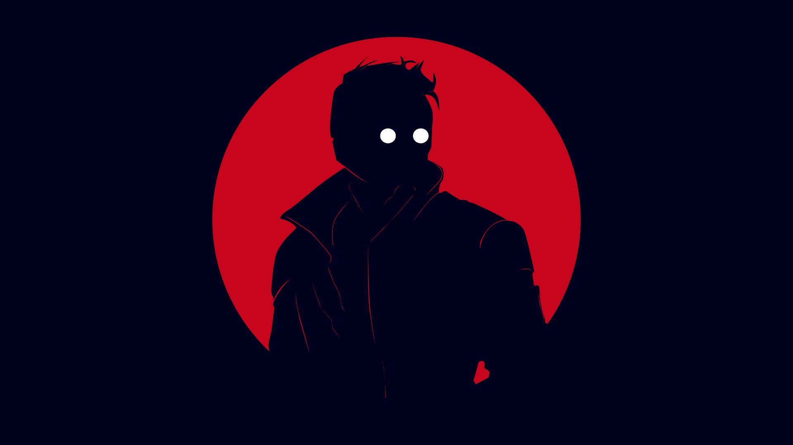

# These are my dotfiles and stuff that I use the most

## my wallpaper

## programs that I use 
- wm:qtile
- compositioning: picom
- shell: [instantshell](https://github.com/instantOS/instantshell)
- bar: polybar
- text editors: emacs and vim
- irc: irssi
- image viewer: sxiv
- browser: firefox
- colors:
  - pywal
  - pywalfox
  - pywal-discord
 - discord client: [BetterDiscord](https://github.com/BetterDiscord/Installer)
 - application launcher: rofi with pywal theme
 - [cbonsai](https://gitlab.com/jallbrit/cbonsai)
