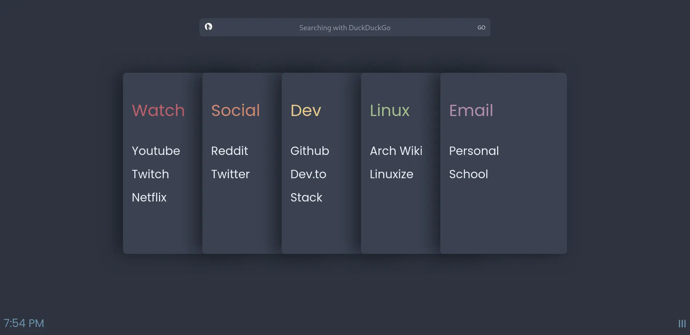

# Screenshot of the startpage



# Important
After generating the colors with pywal copy:
```
colors.css
```
from /home/<USER>/.cache/wal src folder where index.html is located.

__Main features:__
- Search engine selection
- Quick access to your favorite websites which include following by default:
  1 duckduckgo
  2 google
  3 reddit
  4 youtube
- Card-like list navigation
