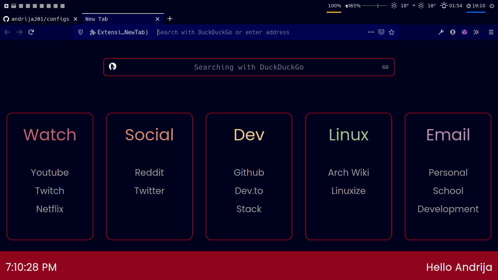

# Screenshot of the startpage



# Important
After generating the colors with pywal copy:
```
colors.css
```
from /home/\<USERNAME\>/.cache/wal src folder where index.html is located.

__Main features:__
- Search engine selection
- Quick access to your favorite websites which include following by default:
  * duckduckgo
  * google
  * reddit
  * youtube
- Card-like list navigation
